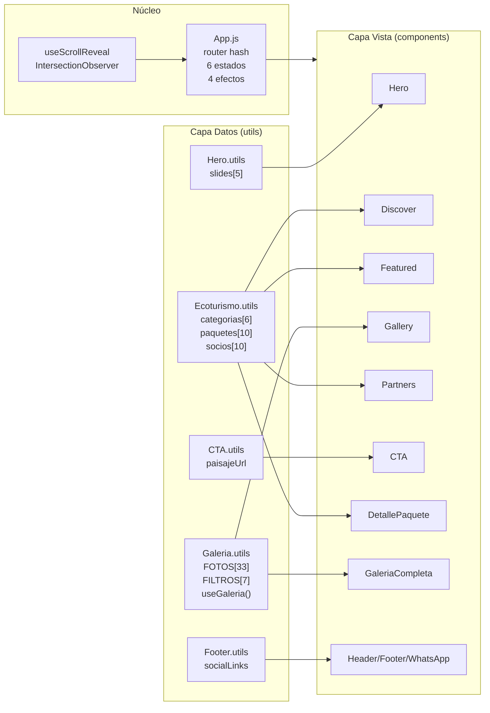
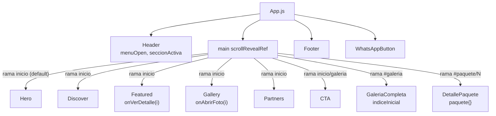
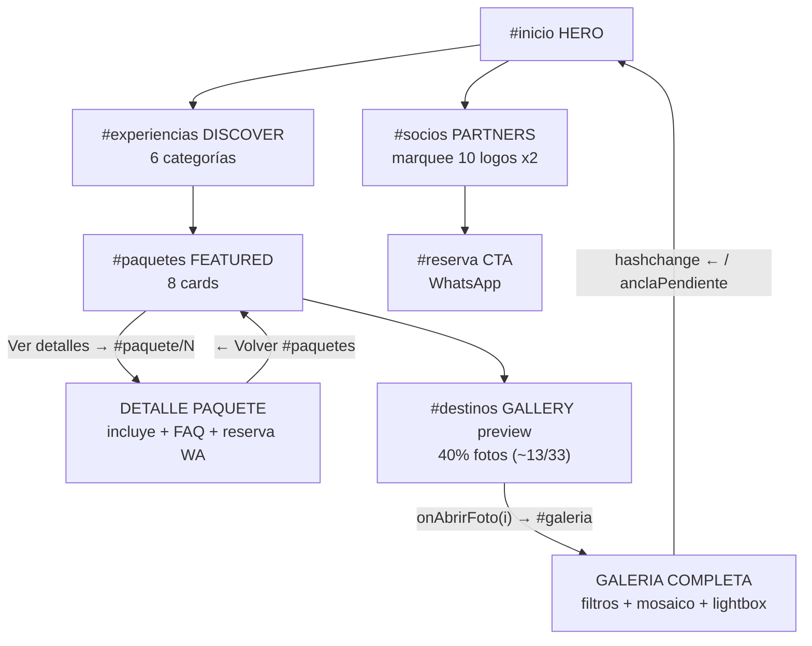
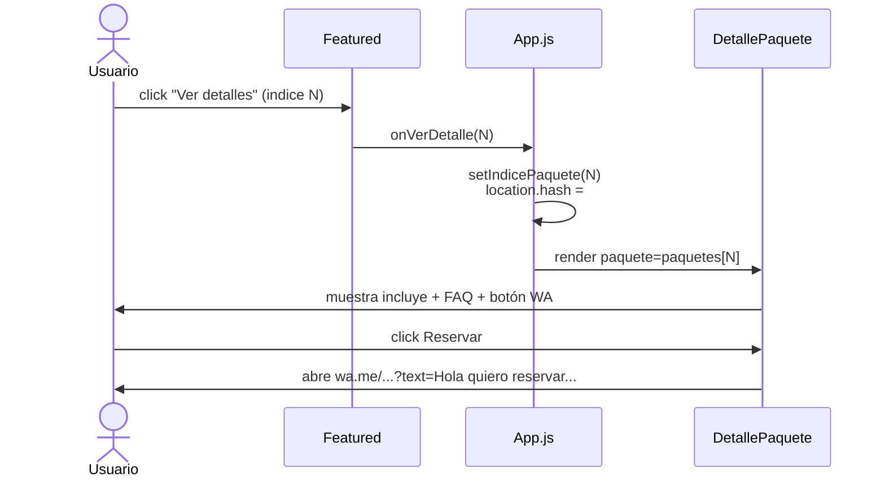
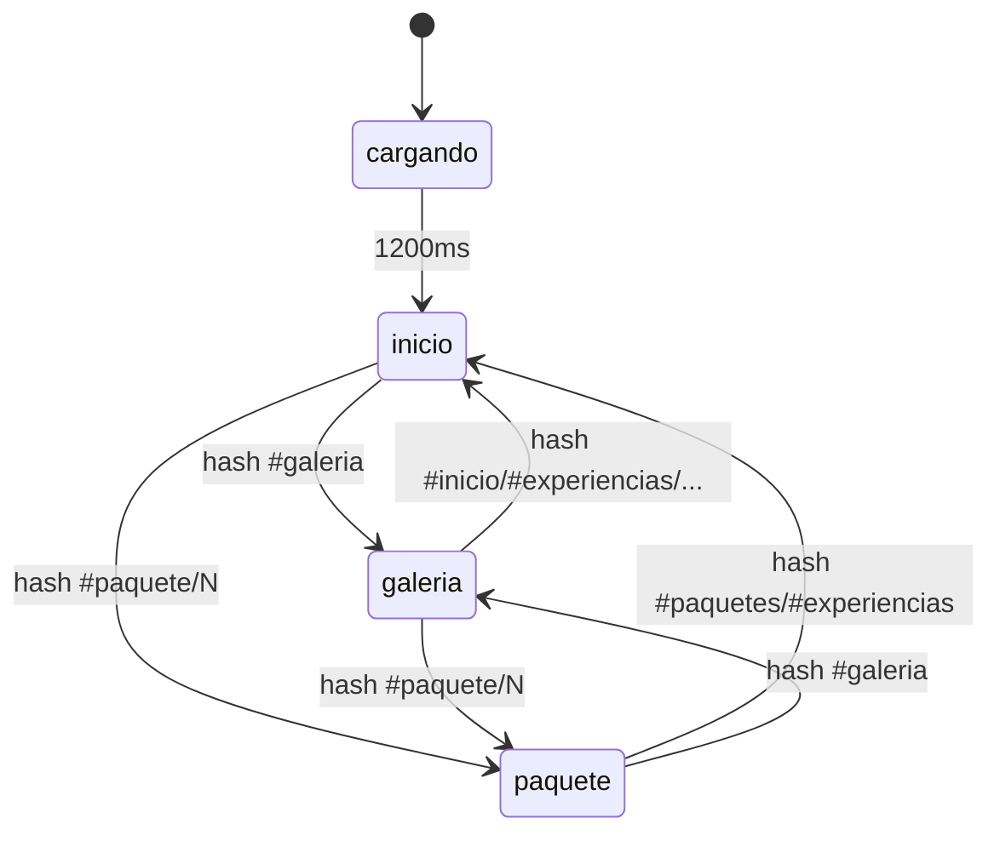
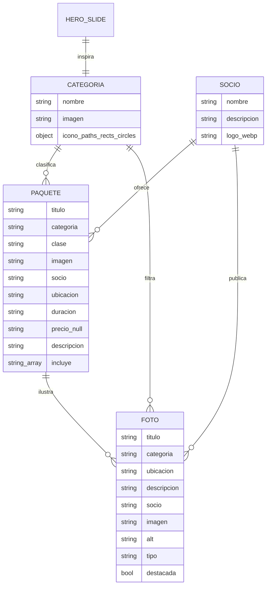
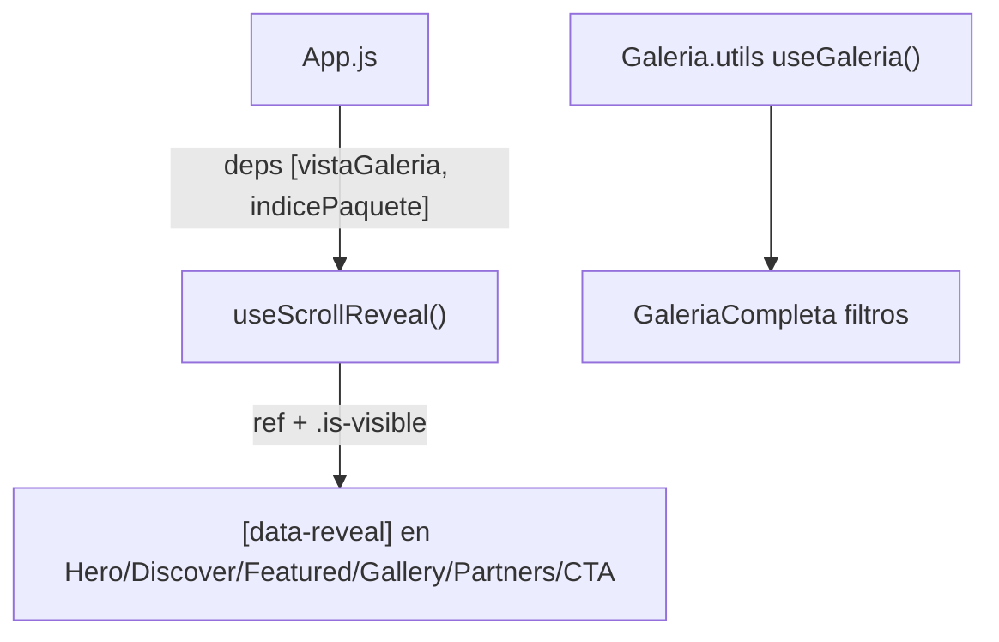
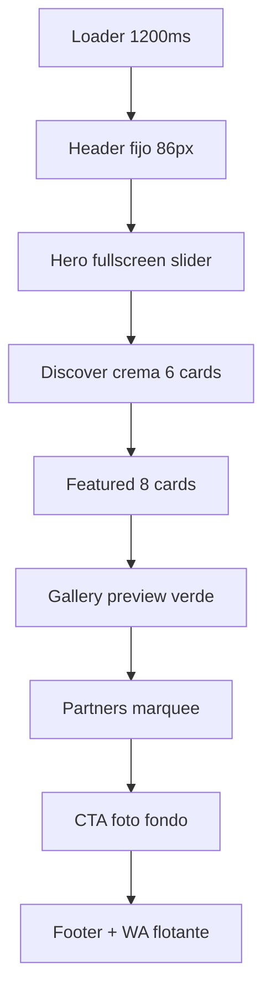
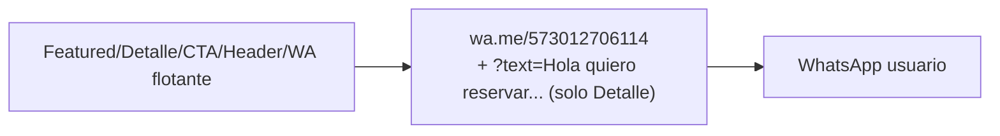
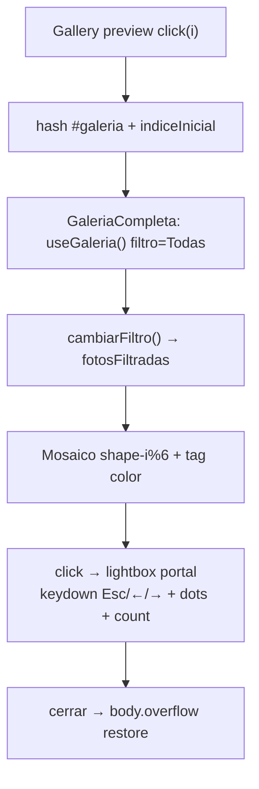

# MEMORIA TÉCNICA — Proyecto Manaure Vive / Villa Adelaida

> **Nombre:** `proyecto_restaurant` (marca pública: **Manaure Vive / Villa Adelaida · Centro Turístico y Ecológico**)
> **Tipo:** Landing page + Galería + Detalle de paquetes ecoturísticos
> **Stack:** React 19 + react-scripts 5 (Create React App) · Sin react-router · Enrutamiento manual por `window.location.hash`
> **Despliegue:** `gh-pages` → `https://fran3004.github.io/proyecto_restaurant` (`homepage` en `package.json`)
> **Fecha memoria:** 2026-09-26 (rev. 2: 10 paquetes Manaure Vive + convenios N + relacionados)
> **Archivos base analizados:** `src/App.js` (285 líneas), `src/index.js`, `src/components/**`, `src/utils/**`, `src/styles/**`, `public/index.html`, `public/manifest.json`, `EXPERIENCIAS_Y_SOCIOS.md`

---

## ÍNDICE

1. [Visión general y objetivos](#1-visión-general-y-objetivos)
2. [Stack tecnológico y scripts](#2-stack-tecnológico-y-scripts)
3. [Estructura física del proyecto](#3-estructura-física-del-proyecto)
4. [Arquitectura lógica](#4-arquitectura-lógica)
5. [Grafo de componentes](#5-grafo-de-componentes)
6. [Enrutamiento por hash y estados](#6-enrutamiento-por-hash-y-estados)
7. [Modelo de datos](#7-modelo-de-datos)
8. [Fichas de componentes (props, estados, funciones)](#8-fichas-de-componentes-props-estados-funciones)
9. [Utils, hooks y datos](#9-utils-hooks-y-datos)
10. [Sistema de diseño y estilos](#10-sistema-de-diseño-y-estilos)
11. [Assets multimedia](#11-assets-multimedia)
12. [SEO, PWA y accesibilidad](#12-seo-pwa-y-accesibilidad)
13. [Flujos funcionales clave](#13-flujos-funcionales-clave)
14. [Tests](#14-tests)
15. [Deuda técnica y roadmap](#15-deuda-técnica-y-roadmap)
16. [Glosario](#16-glosario)

---

## 1. Visión general y objetivos

Plataforma web promocional de ecoturismo en **Manaure, Cesar (Colombia)** y Serranía del Perijá. Objetivos:

- Mostrar **10 paquetes** (red Manaure Vive 2026-09-26, antes 5): Adrenalina Serrana · Cumbres de Niebla & Romance · Ruta del Grano a la Fruta · Expedición Metallura · Pasadía Oasis Familiar · Safari Fotográfico · Sabores del Perijá · Travesía Sabana Rubia · Bienestar & Desconexión · Gran Circuito 3D/2N (10 aliados).
- Mostrar **10 socios aliados** (hospedaje, aventura, gastronomía, foto).
- Galería fotográfica filtrable de **33 items** + lightbox.
- Conversión por **WhatsApp** (`https://wa.me/573012706114`): reserva, CTA, botón flotante.
- Navegación **single-page por anclas + 2 vistas full** (galería completa, detalle paquete).

No hay backend, carrito ni autenticación. Todo es estático + estado local React.

---

## 2. Stack tecnológico y scripts

| Capa      | Tecnología                                                       | Versión / Nota                                                     |
| --------- | ----------------------------------------------------------------- | ------------------------------------------------------------------- |
| UI        | `react`, `react-dom`                                          | ^19.2.8 (`StrictMode` en `index.js`)                            |
| Tooling   | `react-scripts`                                                 | 5.0.1 (CRA: webpack + Babel + ESLint)                               |
| Tests     | `@testing-library/react`, `jest-dom`, `user-event`, `dom` | RTL + jest                                                          |
| Métricas | `web-vitals`                                                    | ^2.1.4 (`reportWebVitals.js`)                                     |
| Deploy    | `gh-pages`                                                      | ^6.3.0 (`predeploy` + `deploy -d build`)                        |
| Estilos   | CSS puro, sin frameworks                                          | 18 ficheros en`src/styles/`                                       |
| Fuentes   | Google Fonts                                                      | `Playfair Display + Montserrat + Caveat` (link en `index.html`) |

Scripts (`package.json`):

```json
"start": "react-scripts start",
"build": "react-scripts build",
"test": "react-scripts test",
"eject": "react-scripts eject",
"predeploy": "npm run build",
"deploy": "gh-pages -d build"
```

`browserslist`: producción `>0.2%, not dead, not op_mini all`; desarrollo últimas versiones Chrome/Firefox/Safari.

---

## 3. Estructura física del proyecto

```
proyecto_restaurant/
├── package.json / package-lock.json
├── README.md (genérico CRA)
├── EXPERIENCIAS_Y_SOCIOS.md (referencia negocio)
├── MEMORIA.md (este archivo)
├── public/
│   ├── index.html (lang=es, SEO, OG, JSON-LD, fonts)
│   ├── manifest.json (PWA Villa Adelaida)
│   ├── robots.txt
│   └── assets/ (~71 ficheros)
│       ├── brand/ (5: logopagina*.jpeg/png, logo-principal*.png)
│       ├── hero/ (5: WhatsApp Image 2026-09-*.jpeg, IMG_9200.JPG.jpeg)
│       ├── icons/ (6: favicon.ico/png, logo-192/512.png)
│       ├── partners/ (11 .webp)
│       ├── galeria/aventura/Manaure-aventuras/ (11 .jpeg aventura1..11)
│       ├── galeria/Naturaleza/Metallura/ (13 .jpeg naturaleza1..13)
│       ├── galeria/Gastronomia/La casa de las arepas/ (15 mixtos .HEIC/.JPG/.MOV)
│       ├── videos/recuerdos/ (3 .mp4, no usados aún)
│       ├── cta_paginapie.jpeg
│       └── imagen_paisaje_pagina.jpeg
├── build/ (salida `npm run build`)
└── src/
    ├── App.js (162 líneas: orquestador + router hash + loader)
    ├── index.js (17 líneas: createRoot + StrictMode + index.css)
    ├── reportWebVitals.js (13 líneas: CLS/FID/FCP/LCP/TTFB)
    ├── App.test.js (48 líneas: 4 tests RTL)
    ├── setupTests.js (jest-dom)
    ├── components/
    │   ├── layout/Header.jsx / Footer.jsx / WhatsAppButton.jsx
    │   ├── inicio/Hero.jsx / Discover.jsx / Featured.jsx / Gallery.jsx / Contacto.jsx / Partners.jsx / CTA.jsx / PaquetesCompleta.jsx / Descubre.jsx / DetallePaquete.jsx / ReservarExperiencia.jsx
    │   ├── galeria/GaleriaCompleta.jsx (190 líneas, la más compleja)
    ├── utils/
    │   ├── useScrollReveal.js (hook IntersectionObserver)
    │   ├── inicio/Hero.utils.js / Galeria.utils.js / Ecoturismo.utils.js / CTA.utils.js
    │   ├── layout/Footer.utils.js
    └── styles/ (18 CSS)
        ├── global/App.css (353) / index.css (1)
        ├── layout/Header.css (285) / Footer.css (200) / WhatsAppButton.css (117)
        ├── inicio/Hero.css (286) / Discover.css (171) / Featured.css (237) / Gallery.css (59) / DetallePaquete.css (40) / CTA.css (152) / Partners.css (123)
        ├── galeria/GaleriaBase.css (121) / GaleriaCompleta.css (5 imports) / GaleriaFiltros.css (36) / GaleriaMosaico.css (130) / GaleriaLightbox.css (178) / GaleriaResponsive.css (97)
```

> Diagrama de árbol físico en texto — las carpetas vacías (`contacto`, `recuerdos`, `reservas`) se eliminaron el 2026-09-26 (ver §15).

---

## 4. Arquitectura lógica

Patrón: **Componentes presentacionales + ficheros `*.utils.js` como mini-store estático + `App.js` como controlador frontal**.



Principios:

- **Unidireccional:** `utils` → `components` → `App`. Ningún componente escribe en utils.
- **Sin router externo:** `App.js` escucha `hashchange` y decide qué rama renderizar.
- **Estilos desacoplados:** cada componente tiene su CSS espejo en `src/styles/` (naming `PascalCase.jsx` ↔ `PascalCase.css`, salvo galería que se divide en 5 parciales).
- **Imágenes por `PUBLIC_URL`:** `src={`${process.env.PUBLIC_URL}/assets/...`}` para compatibilidad con `gh-pages` (subpath).

---

## 5. Grafo de componentes

### 5.1 Árbol de render (quién monta a quién)



### 5.2 Grafo de navegación del usuario



### 5.3 Diagrama de secuencia — ver detalle de paquete



---

## 6. Enrutamiento por hash y estados

`src/App.js:18-21` helper:

```js
obtenerIndicePaquete() // /^#paquete\/(\d+)$/ → Number | null
```

### 6.1 Tabla hash → vista

| Hash                                                                                               | `vistaGaleria` | `indicePaquete` | Rama render                           | Scroll          |
| -------------------------------------------------------------------------------------------------- | ---------------- | ----------------- | ------------------------------------- | --------------- |
| `` /`#inicio`                                                                                    | false            | null              | Landing (`Hero→CTA`)               | top / ancla     |
| `#experiencias` `#paquetes` `#destinos` `#socios` `#nosotros` `#reserva` `#contacto` | false            | null              | Landing +`scrollIntoView` al `id` | smooth al ancla |
| `#galeria`                                                                                       | true             | null              | `GaleriaCompleta + CTA`             | top (auto)      |
| `#paquete/0` … `#paquete/9`                                                                   | false            | 0…9              | `DetallePaquete`                    | top             |
| hash desconocido                                                                                   | false            | null              | Landing (`seccionActiva=inicio`)    | restaurado      |

### 6.2 Estados en `App()` (`src/App.js:24-38`)

| Estado                        | Tipo         | Init                                             | Quién lo usa                      |
| ----------------------------- | ------------ | ------------------------------------------------ | ---------------------------------- |
| `cargando`                  | boolean      | `true` → `false` a 1200ms                   | Loader`page-loader` + spinner    |
| `menuOpen`                  | boolean      | `false`                                        | `Header` (hamburguesa)           |
| `vistaGaleria`              | boolean      | `hash==='#galeria'`                            | Elige rama galería vs landing     |
| `indicePaquete`             | number\|null | `obtenerIndicePaquete()`                       | Elige rama detalle                 |
| `seccionActiva`             | string       | parse hash (`inicio\|galeria\|experiencias\|...`) | `Header` resalta link `active` |
| `indiceGaleriaSeleccionada` | number\|null | `null`                                         | `GaleriaCompleta indiceInicial`  |

Refs: `enGaleriaRef` (espejo), `posInicioGaleria` (scrollY para restaurar), `anclaPendiente` (id para `scrollIntoView` al volver), `scrollRevealRef = useScrollReveal([vistaGaleria, indicePaquete])`.

### 6.3 Efectos (`src/App.js:45-113`)

1. `[]` — `hashchange listener`: recalcula `esGaleria`, `esPaquete`, `nuevaSeccion`; si es paquete fuerza `seccionActiva='paquetes'`; gestiona `anclaPendiente` vs `posInicioGaleria`.
2. `[paqueteSeleccionado]` — `scrollTo(0,0)` al entrar a detalle.
3. `[paqueteSeleccionado]` — si hash es `#paquetes` y no hay paquete, `scrollIntoView` a `#paquetes`.
4. `[vistaGaleria, indiceGaleriaSeleccionada]` — entrar a galería: `scrollTo(0,0)`; salir: `scrollIntoView(ancla)` o restaura `posInicioGaleria`.
5. `[]` — `setTimeout 1200ms → setCargando(false)`.

### 6.4 Máquina de estados



Callbacks que disparan transiciones (`src/App.js:143-151`):

```js
Featured.onVerDetalle(i) → setIndicePaquete(i) + hash #paquete/i
Gallery.onAbrirFoto(i) → setIndiceGaleriaSeleccionada(i) + hash #galeria
Header: <a href="#inicio|#experiencias|#paquetes|#destinos|#galeria|#socios|#nosotros"> + <a href="#reserva">Reservar</a>
DetallePaquete: <a href="#paquetes">← Volver</a>
```

---

## 7. Modelo de datos

Todo estático en `src/utils/inicio/Ecoturismo.utils.js` + `Galeria.utils.js` + `Hero.utils.js`. No hay API ni localStorage.

### 7.1 Diagrama Entidad-Relación (lógico)



### 7.2 Tablas reales

**`categoriasEcoturismo[6]`** — Naturaleza, Aventura, Fotografía, Tours, Gastronomía, Eventos. Cada una: `imagen` (Unsplash) + `icono` SVG declarativo (`paths/rects/circles`).

**`paquetesEcoturismo[10]`** (`src/utils/inicio/Ecoturismo.utils.js`, rev. 2026-09-26, todos con `galeria[5]`, `socios[]`, `itinerario[]`, `noIncluye[]`, todos con precio definido):

| # | Título | Cat. | Socios | Duración | Precio |
| - | ------ | ---- | ------ | -------- | ------ |
| 0 | Adrenalina Serrana: Tierra & Cielo | Aventura | Manaure Aventura, Cuatri Tours Manaure, Villa Adelaida, La Casa de las Arepas | 1 día | $340.000 |
| 1 | Cumbres de Niebla & Romance | Tours | Mashiramo Glamping, Absolom Casita de la Mora, Villa Adelaida | 2 días / 1 noche | $790.000 (ref. pareja) |
| 2 | Ruta del Grano a la Fruta: Café & Mora | Tours | Coruscans, Absolom Casita de la Mora, La Casa de las Arepas, Los Pinos Manaure | 1 día | $145.000 |
| 3 | Expedición Metallura: Joyas Aladas | Naturaleza | Metallura, Coruscans, Villa Adelaida (Reserva ProAves citada en texto) | 2 días / 1 noche | $520.000 |
| 4 | Pasadía Oasis Familiar: Aguas Vivas | Tours | Villa Adelaida, Los Pinos Manaure (Balneario Río citado en texto) | 1 día | $115.000 (ref. adulto) |
| 5 | Safari Fotográfico: Nidos & Hora Dorada | Fotografía | PHOTours, Los Pinos Manaure, Absolom Casita de la Mora, Villa Adelaida | 1 día | $290.000 |
| 6 | Sabores del Perijá: Ruta Culinaria | Gastronomía | La Casa de las Arepas, Coruscans, Villa Adelaida, Absolom Casita de la Mora | 1 día | $175.000 |
| 7 | Travesía Sabana Rubia: Páramo Místico | Aventura | Metallura, Mashiramo Glamping, Villa Adelaida | 1 día | $280.000 |
| 8 | Bienestar & Desconexión: Montaña Zen | Tours | Coruscans, Los Pinos Manaure, Villa Adelaida | 2 días / 1 noche | $390.000 |
| 9 | Gran Circuito Manaure Vive 3D/2N | Tours | Los 10 aliados | 3 días / 2 noches | $1.350.000 |

> Antes (2026-09-22): 5 paquetes (senderismo $80.000, aves $70.000, gastronomía $60.000, río $120.000, tour 3d/2n sin precio).

Campo `clase`: `'' | 'green' | 'blue'` → color del tag en `Featured`.

**`sociosEcoturismo[10]`** — Manaure Aventura, Villa Adelaida, Cuatri Tours Manaure, PHOTours, Mashiramo Glamping, Absolom Casita de la Mora, Coruscans, La Casa de las Arepas, Los Pinos Manaure, Metallura. Cada uno `{nombre, descripcion, logo:*.webp}`.

**`FOTOS_GALERIA[33]`** (`Galeria.utils.js`): `11 aventura (Manaure Aventuras) + 13 naturaleza (Metallura) + 5 gastronomía (La Casa de las Arepas: 2 jpg + 3 .MOV) + 4 Unsplash (Tours/Momentos/Gastronomía/Cultura)`. Campos `{titulo, categoria, ubicacion, descripcion, socio, socioLogo?, imagen, alt, tipo?, destacada?}`.

**`slides[5]`** (`Hero.utils.js`): `{img: PUBLIC_URL/assets/hero/..., label, description}` — Naturaleza viva, Paisajes ecológicos, Cabañas en el bosque, Sabores de la Villa, Experiencias para recordar. `INTERVAL=5000ms`.

**`FILTROS_GALERIA[7]`** — Todas, Naturaleza, Aventura, Gastronomía, Tours, Cultura, Momentos (con icono SVG). **`COLORES_CATEGORIA`** — Naturaleza `#3b8a55`, Aventura `#F28C18`, Gastronomía `#c2571b`, Tours `#3d7890`, Cultura `#7c5cbf`, Momentos `#0e7c86`.

**`socialLinks`** (`Footer.utils.js`): facebook `villadelaidatur`, instagram `restaurantevilladelaida`. **`paisajeUrl`** (`CTA.utils.js`): `PUBLIC_URL/assets/cta_paginapie.jpeg`.

---

## 8. Fichas de componentes (props, estados, funciones)

### 8.1 `layout/Header.jsx` (rev. 2026-09-26: sin lupa; botón Reservar solo texto abre el modal)

- **Props:** `menuOpen:boolean`, `onMenuToggle:()=>void`, `galeriaActiva:boolean`, `seccionActiva:string='inicio'`, `onReservar:()=>void`.
- **Estado/efectos internos:** ninguno.
- **Funciones:** `closeAll()` (cierra menú), `isSectionActive(sec)` (compara con `seccionActiva`).
- **Render:** `header.site-header#top` → `a.brand[href=#inicio]` (`logo-principal.png`) + `button.menu-toggle[aria-expanded]` ☰ + `nav#site-navigation.nav[.open]` (6 links con clase `active`) + `.header-actions` (solo `button.reserve-top` “Reservar” sin icono → abre modal `reserva-modal` en `App.js` con `ReservarExperiencia`). Sin `header-search`.

### 8.2 `layout/Footer.jsx` (46 líneas)

- **Props/estado:** ninguno. Importa `socialLinks`.
- **Render:** `footer` → `.footer-main` (`.footer-brand`: `logopagina-clean.png` + `h3 Manaure Ecoturístico` + `p`; `.footer-socials`: Facebook/Instagram `target=_blank` con SVG; `.footer-links`: 7 anclas) + `.footer-bottom` (`Manaure·Cesar | © 2026`).

### 8.3 `layout/WhatsAppButton.jsx` (23 líneas)

- **Const:** `WHATSAPP_URL='https://wa.me/573012706114'`.
- **Render:** `a.whatsapp-floating-button[target=_blank]` + `span.whatsapp-tooltip` ("¿Necesitas ayuda?") + `svg.whatsapp-icon`.

### 8.4 `inicio/Hero.jsx` (73 líneas) — slider fullscreen

- **Props:** ninguna. `INTERVAL=5000, slides[5]`.
- **Estados:** `current:number=0`, `prev:number|null`, `animating:boolean`.
- **Funciones:** `goTo(idx)` (guarda prev, `animating=true`, timeout 900ms limpia), `next()` (circular).
- **Efecto:** `setInterval(next, INTERVAL)` + cleanup.
- **Render:** `section.hero#inicio` → `slides.map div.hero-bg[.active/.exit]` (`backgroundImage`) + `.hero-overlay` + `.hero-content` (eyebrow `MANAURE VIVE`, `h1`, `p`, 2 `a.btn`: `#experiencias` / `#paquetes`) + `.hero-slogan` ("¡Vive lo extraordinario!") + `.hero-dots` + `.hero-progress-bar[animationDuration=INTERVAL]`.

### 8.5 `inicio/Discover.jsx` (rev. 2026-09-26: tarjetas eliminadas; ahora 6 círculos → filtro preseleccionado)

- **Props/estado:** ninguno. `categoriasEcoturismo[6]` + mapa por orden a intereses `[naturaleza, aventura, fotografia, deportes, gastronomia, cultura]`.
- **Render:** `section.discover#experiencias[data-reveal]` → head (`¿QUÉ QUIERES HACER?` + `h2 Descubre tu experiencia`) + `.circulos-grid`: `a.circulo-tema[href=#descubre/<tema>]` (círculo verde 84px con icono SVG + etiqueta) + banner `descubrir-banner` (`COMENZAR AHORA → #descubre`). `App.js` parsea `#descubre/<id>` (validado, fallback a `#descubre`) y `Descubre` acepta `interesInicial`.

### 8.6 `inicio/Featured.jsx` — muestra 8 de 10 (`PAQUETES_VISIBLES = 8`)

- **Props:** `onVerDetalle:(indice:number)=>void`.
- **Lógica N convenios (Solución A, 2026-09-26):** proveedor muestra `socios.slice(0,2)` + `+N más` si hay más de 2 (ej. Gran Circuito: `Manaure Aventura, Villa Adelaida +8 más`).
- **Render:** `section.featured#paquetes` → title (eyebrow + `h2` + link `#socios`) + `.featured-cards`: `paquetesEcoturismo.slice(0,8).map article.featured-card` (imagen + `span.featured-tag.{clase}` + kicker + precio/`Consultar` + `h3` + `Por socio` + meta `⌖ ◷` + descripción + `button.small-btn onClick=onVerDetalle(i)`).

### 8.7 `inicio/Gallery.jsx` (36 líneas) — preview

- **Props:** `onAbrirFoto?:(indiceGlobal:number)=>void`.
- **Lógica:** `fotosVistaPrevia = FOTOS_GALERIA.slice(0, ceil(len*0.4))` (~13 de 33).
- **Render:** `section.gallery#destinos` → head + `.gallery-grid`: `button.gallery-item-button[aria-label][data-reveal]` con `img[loading=lazy]`; `onClick → onAbrirFoto(findIndex)`.

### 8.8 `inicio/DetallePaquete.jsx` — galería mockup + convenios N + relacionados (rev. 2026-09-26)

- **Props:** `paquete:{titulo, categoria, socio, socios[], ubicacion, duracion, precio, descripcion, imagen, galeria[5], incluye[], noIncluye[], itinerario[]}`, `onReservar?`.
- **Estados:** `fecha/adultos/ninos/bebes/nombre/documento/telefono/recogida`, `modalAbierto`, `favorito`, `preguntaAbierta`, `visor`, `mostrarConvenios` (nuevo: colapsado N convenios).
- **Galería (medidas mockup `paquete_responsive_pc_movil.html`):** `grid 2fr/1fr height:384px radius:24px`, principal `object-cover + hover scale`, lateral `grid 1fr/1fr`, thumb 2 con overlay dinámico `{N} fotos + Ver más` → abre visor en la foto clicada (`setVisor(i+1)`). Móvil: principal 288px, lateral en fila.
- **Convenios (Solución A):** si `N<=3` pinta normal; si `N>3` pinta 3 compactos (logo 48px) + botón `Ver los N convenios (3 de N)` que expande mini-fila. Cards `Featured` muestran `2 +N más`.
- **Relacionados:** bloque `También te puede interesar` con 3 cards (misma categoría primero, excluye actual) → `href=#paquete/M` (App.js remonta por `key` + scroll suave + animación `dt-entrada` 0.45s en `.detalle-contenedor`, con `prefers-reduced-motion`).
- **Loader de detalle (2026-09-26):** `DetallePaquete` muestra 1100ms la misma pantalla de carga del filtro (`db-cargando-full` + spinner + barra + 3 `db-skel`, estilos de `Descubre.css`) antes del contenido; así el cambio entre paquetes relacionados se percibe. Tests con `timeout: 3000`.
- **FAQ (2026-09-26):** el toggle abierto usa escape unicode U+2212 en string JS (antes entidad HTML en string y se pintaba literal).
- **Render:** `main.detalle-paquete` → encabezado (`a.detalle-back[href=#paquetes]` + grid copy/imagen + `a.btn detalle-reserve[wa.me]`) + `.detalle-beneficios ✓` + 2 cards (QUÉ INCLUYE / IDEAL PARA) + FAQ acordeón (`aria-expanded`) + CTA WhatsApp.

### 8.9 `inicio/CTA.jsx` (22 líneas)

- **Props/estado:** ninguno. `paisajeUrl`.
- **Render:** `section.cta#reserva[data-reveal][style=--cta-image:url(...)]` → slogan + `h2 ¿Listo para vivir Manaure?` + `a.btn.whatsapp[wa.me]` con SVG.

### 8.10 `inicio/Partners.jsx` — marquee infinito con Instagram (rev. 2026-09-26)

- **Props/estado:** ninguno. `conveniosEcoturismo[10]` (cada uno con campo `instagram`).
- **Render:** `section.partners#socios` → head (sin link “Ver todos los convenios”) + `.partner-grid > .partner-track`: `[...socios, ...socios]` (duplicado para loop CSS; 2ª mitad `aria-hidden` + `tabIndex=-1`) → `a.partner[target=_blank]` (logo + `h3`, toda la tarjeta clicable sin avisos visibles). Solo esta sección muestra los Instagram.

### 8.11 `galeria/GaleriaCompleta.jsx` (190 líneas) — la más compleja

- **Subcomponente:** `IconoFiltro({icono})` → `svg` (rects/circles/paths).
- **Props:** `indiceInicial:number|null`.
- **Hook:** `useGaleria() → {filtroActivo, setFiltroActivo, fotosFiltradas}`.
- **Estado:** `seleccionada:number|null = indiceInicial`.
- **Funciones:** `cambiarFiltro(f)` (resetea + set), `cerrar` (`useCallback`), `avanzar(dir)` (módulo circular), `renderMedia(foto, isLightbox)` (video → `<video controls/autoPlay/muted/loop>` + badge ▶, sino ``).
- **Efecto:** si hay selección: `keydown` (Escape/Arrows) + `body.overflow=hidden`, cleanup restaura.
- **Render:** `section.galeria#galeria` → head (`GALERÍA`, `h2 Momentos que inspiran`, `COLOMBIA • N FOTOS`) + `.galeria-filters[role=tablist]` (7 `button[role=tab][aria-selected]`) + `.galeria-grid` (`button.galeria-item.galeria-shape-{i%6}[.featured]` + tag con `COLORES_CATEGORIA` + caption) + lightbox por `createPortal(div[role=dialog][aria-modal], body)` (foto + nav prev/next + count + dots + info + host + link `#paquetes`).

### 8.12 Entry points

- **`src/components/inicio/Descubre.jsx` (rev. 2026-09-26):** `PAQUETES_DEMO[6]` remapeados a nuevos índices (0 Adrenalina, 1 Cumbres, 3 Metallura, 6 Sabores, 5 Safari, 2 Grano-Fruta) + `DESTACADOS_DEMO[3]` (Cumbres/Adrenalina/Sabores). Avatares apilados + texto socios (2 por demo, sin cambios de diseño).
- **Fix filtros Descubre (2026-09-26, bug grave):** intereses fuera del reveal (`data-reveal` quitado + blindaje `opacity:1`) para que la selección nunca pueda quedar invisible (solo verde + sombra, sin badge/check extra); duraciones honestas `[Día completo, Fin de semana]` (se eliminó “Medio día” huérfano que daba 0 resultados); toggle-off en duración/estilo/compañía; estilo y compañía ahora sí filtran (`estilos[]`/`companias[]` por demo); botón “Limpiar filtros” como enlace sutil en cabecera y estado vacío (diseño previo restaurado; botón `db-find` sin flecha `→`); `db-find` sticky móvil con safe-area). Regresión en `src/Descubre.filtros.test.js` (4 tests).
- **Fix pantalla vacía tras buscar (2026-09-26, causa raíz):** el loader desmontaba hero/filtro/resultados y al remontar los nodos `data-reveal` quedaban sin `is-visible` (el observer de `App` no se re-ejecuta) → `opacity:0` permanente en navegador real. `Descubre` ahora re-sincroniza su reveal con efecto local en `[cargando]` (mismo observer/threshold). Cubierto por test reveal con `IntersectionObserver` simulado.
- **Fix selección+móvil Descubre (2026-09-26):** la lógica React estaba bien (test temporal lo confirmó, luego eliminado); se reforzó lo visual: badge check naranja en `.db-choice.active`, sombra en activos, `focus-visible`, iconos con `flex:none/display:block`. Móvil ≤620px: minis con wrap (`flex:1 1 70px`, antes se desbordaban 4 en 360px), grupos apilados con divisor inferior, sort a ancho completo, meta/partner con wrap, featured-head con wrap, botón sticky con `safe-area`.

- **`src/index.js`:** `createRoot(#root).render(<StrictMode><App/></StrictMode>)` + `import './styles/global/index.css'` + `reportWebVitals()` sin callback.
- **`src/reportWebVitals.js`:** si `onPerfEntry` es función, importa `web-vitals` y suscribe `getCLS/FID/FCP/LCP/TTFB`.
- **`src/setupTests.js`:** `import '@testing-library/jest-dom'`.

---

## 9. Utils, hooks y datos

| Fichero                              | Export                                                                                                              | Rol                                                                                                                                                                                                                                             |
| ------------------------------------ | ------------------------------------------------------------------------------------------------------------------- | ----------------------------------------------------------------------------------------------------------------------------------------------------------------------------------------------------------------------------------------------- |
| `utils/useScrollReveal.js`         | `default useScrollReveal(deps=[]) → ref`                                                                         | Añade`scroll-reveal-ready` al contenedor, observa `[data-reveal]` con `IntersectionObserver (threshold 0.12, rootMargin -8%)` → `is-visible` + `unobserve`. Fallback sin IO. Usado en `App` con `[vistaGaleria, indicePaquete]` |
| `utils/inicio/Hero.utils.js`       | `INTERVAL`, `slides[5]`                                                                                         | Slides hero (img + label + description)                                                                                                                                                                                                         |
| `utils/inicio/Ecoturismo.utils.js` | `categoriasEcoturismo[6]`, `paquetesEcoturismo[10]`, `sociosEcoturismo[10]`, `galeriaEcoturismo[6]` (legado) | Store principal negocio                                                                                                                                                                                                                         |
| `utils/inicio/Galeria.utils.js`    | `FILTROS_GALERIA[7]`, `COLORES_CATEGORIA`, `FOTOS_GALERIA[33]`, `useGaleria()`                              | Fotos locales + hook filtro (`useState('Todas')`)                                                                                                                                                                                             |
| `utils/inicio/CTA.utils.js`        | `paisajeUrl`                                                                                                      | Fondo CTA                                                                                                                                                                                                                                       |
| `utils/layout/Footer.utils.js`     | `socialLinks`                                                                                                     | Facebook/Instagram                                                                                                                                                                                                                              |



---

## 10. Sistema de diseño y estilos

### 10.1 Tokens (`src/styles/global/App.css:353`)

```css
:root {
  --color-primary: #06452f;   /* verde profundo header/gallery/footer */
  --color-secondary: ...;     /* acento cálido */
  --page-padding: ...;
  /* + fuentes, page-loader, scroll-reveal ready/is-visible */
}
```

Paleta funcional: verde selva `#06452f` (confianza/naturaleza), crema `#f7f4ec` (Discover/Contacto/Featured/Partners), etiquetas por categoría (§7.2), CTA con foto de fondo + overlay. (2026-09-26: se probaron arena/salvia en Featured/Partners y se revirtieron a crema por gusto del dueño.)

Tipografías: `Playfair Display` (títulos serif), `Montserrat` (cuerpo), `Caveat` (slogans manuscritos: "¡Vive lo extraordinario!", "¡Tu próxima aventura!").

### 10.2 Mapa CSS → componente

| CSS                               | Líneas | Estiliza                                                                        |
| --------------------------------- | ------- | ------------------------------------------------------------------------------- |
| `global/App.css`                | 353     | Tokens, base, loader, scroll-reveal                                             |
| `global/index.css`              | 1       | Solo comentario                                                                 |
| `layout/Header.css`             | 285     | Header 86px fijo, brand, nav,`.active`, hamburguesa, `reserve-top`          |
| `layout/Footer.css`             | 200     | Footer verde, brand/socials/links, bottom                                       |
| `layout/WhatsAppButton.css`     | 117     | Botón flotante fixed 24px/z-1100, tooltip, pulse                               |
| `inicio/Hero.css`               | 286     | Slider fullscreen, fade 900ms`.active/.exit`, overlay, dots, progress-bar     |
| `inicio/Discover.css`           | 171     | Fondo crema, grid cards, icono circular                                         |
| `inicio/Featured.css`           | 237     | Cards grid,`.featured-tag(.green/.blue)`, `.featured-media` fondo `#06452f` (2026-09-26, antes beige), precio, `small-btn`               |
| `inicio/Gallery.css`            | 59      | Fondo`#06452f`, grid preview                                                  |
| `inicio/DetallePaquete.css`     | 40+     | Layout encabezado copy+imagen, beneficios, FAQ, CTA + galería mockup (384px/cover/overlay), convenios compactos, relacionados; thumbs fondo `#06452f` (2026-09-26) |
| `inicio/CTA.css`                | 152     | `--cta-image` fondo, slogan, `btn.whatsapp`                                 |
| `inicio/Partners.css`           | 123     | Marquee infinito`.partner-track`, logos                                       |
| `galeria/GaleriaBase.css`       | 121     | Fondo/padding 130px, head/meta                                                  |
| `galeria/GaleriaFiltros.css`    | 36      | Pills filtros`.active`                                                        |
| `galeria/GaleriaMosaico.css`    | 130     | Grid 4col`auto-rows 180px dense`, `shape-0..5`, `featured`, caption hover |
| `galeria/GaleriaLightbox.css`   | 178     | Overlay fixed z-2000, box 2col foto+info, nav/dots/host                         |
| `galeria/GaleriaResponsive.css` | 97      | Breakpoint 900px (head column, grid 2col, lightbox 1col)                        |
| `galeria/GaleriaCompleta.css`   | 5       | Solo`@import` de los 5 parciales                                              |

### 10.3 Diseño visual por sección (orden landing)

1. **Loader:** `logo-principal-completo.png` + spinner, 1200ms.
2. **Header:** fijo 86px, logo izq, nav centro (7 links), lupa decorativa + botón Reservar (WhatsApp) der.; móvil hamburguesa.
3. **Hero `#inicio`:** fullscreen, 5 fondos rotando 5s + fade 900ms, overlay oscuro, eyebrow + H1 + 2 CTAs + slogan + dots + progress-bar.
4. **Discover `#experiencias`:** fondo crema, 6 cards categoría (imagen + icono circular + label) → `#paquetes`.
5. **Featured `#paquetes`:** 8 cards de 10 (foto + tag color + precio + proveedor `2 +N más` + meta ubicación/duración + botón detalle).
6. **Gallery preview `#destinos`:** fondo verde, ~13 fotos, click → `#galeria`.
7. **Partners `#socios`:** marquee infinito 10 logos duplicados (20 nodos).
8. **CTA `#reserva`:** foto `cta_paginapie.jpeg` + "¿Listo para vivir Manaure?" + botón WhatsApp.
9. **Footer + botón flotante WA:** siempre visibles.
10. **Vistas full:** `GaleriaCompleta` (filtros + mosaico 4col + lightbox portal) y `DetallePaquete` (encabezado 2col + incluye + FAQ + CTA).



---

## 11. Assets multimedia

| Categoría               | N  | Detalle                                                                                                                                                                    |
| ------------------------ | -- | -------------------------------------------------------------------------------------------------------------------------------------------------------------------------- |
| Raíz`assets/`         | 2  | `cta_paginapie.jpeg` (CTA), `imagen_paisaje_pagina.jpeg`                                                                                                               |
| `brand/`               | 5  | `logopagina.jpeg`, `logopagina-clean.png` (footer), `logopagina-circulo.png` (favicon), `logo-principal.png` (header), `logo-principal-completo.png` (loader/OG) |
| `hero/`                | 5  | `WhatsApp Image 2026-09-12/13*.jpeg` x4 + `IMG_9200.JPG.jpeg`                                                                                                          |
| `icons/`               | 6  | `favicon.ico/16/32/48`, `logo-192/512 maskable` (PWA)                                                                                                                  |
| `partners/`            | 11 | `*.webp` (10 socios + `logo-principal.webp`)                                                                                                                           |
| `galeria/aventura/`    | 11 | `aventura1..11.jpeg` (Manaure Aventuras)                                                                                                                                 |
| `galeria/Naturaleza/`  | 13 | `naturaleza1..13.jpeg` (Metallura)                                                                                                                                       |
| `galeria/Gastronomia/` | 15 | Mixto`.HEIC(9)+.JPG(2)+.MOV(3)` — solo 5 usados en código (`12.JPG, 8.jpg, 9/10/11.MOV`), resto huérfanos                                                           |
| `videos/recuerdos/`    | 3  | `WhatsApp Video 2026-08-20*.mp4` (no importados, reserva)                                                                                                                |

Convención: locales vía `PUBLIC_URL/assets/...`; externos solo Unsplash (categorías + 4 fotos Tours/Momentos/Cultura).

---

## 12. SEO, PWA y accesibilidad

**`public/index.html` (81 líneas, `lang=es`):** favicon `logopagina-circulo.png`, `viewport`, `theme-color #06452F`, `description`, `author`, `robots index,follow`, OG (`og:title/description/type/image`), `twitter:card summary`, `apple-touch-icon`, `manifest`, `preconnect` fonts, `<title>Manaure Vive|Ecoturismo</title>`, JSON-LD `Restaurant` (tel `+57 301 270 6114`, dir `Troncal vía Arjona Sector La Rosita, Manaure Cesar CO`, `sameAs` instagram), `<div id=root>`.

**`public/manifest.json`:** `short_name Villa Adelaida`, `name Villa Adelaida·Centro Turístico`, `icons[3]`, `start_url .`, `display standalone`, `theme_color #e8a020`, `background #f8f5ee`.

> Inconsistencia: `theme_color` en manifest (`#e8a020`) ≠ `index.html` (`#06452F`).

**Accesibilidad:** `aria-label/expanded/controls/selected`, `role=status/dialog/tablist/tab/tooltip`, `alt` en imágenes, `loading=lazy`, `aria-modal` en lightbox, foco teclado (Escape/flechas). Mejorable: contraste tags, foco visible, `aria-live` en slider.

---

## 13. Flujos funcionales clave

### 13.1 Reserva por WhatsApp (conversión principal)



- `DetallePaquete`: mensaje pre-rellenado con título paquete (`encodeURIComponent`).
- Resto: URL directa sin texto.
- Teléfono canonizado: `+57 301 270 6114` (JSON-LD, WA, footer).

### 13.2 Galería completa



### 13.3 Scroll reveal

`App` → `useScrollReveal([vistaGaleria, indicePaquete])` → `ref` en `main` → `IntersectionObserver` añade `.is-visible` a `[data-reveal]` (section/heading/content/item). Sin IO: todo visible.

---

## 14. Tests

`src/App.test.js` (RTL + jest-dom, `beforeEach: location.hash=''` + `src/Descubre.filtros.test.js` con 5 tests de filtros; total 9 tests en verde):

| # | Acción                                        | Aserción                                                                                        |
| - | ---------------------------------------------- | ------------------------------------------------------------------------------------------------ |
| 1 | Render inicial                                 | Heading hero`/Naturaleza, cultura, gastronomía y experiencias/` existe                        |
| 2 | Click preview`alt=/Experiencia de aventura/` | `hash==='#galeria'` + dialog `/Aventura en Manaure/`; click tab `Naturaleza` cierra dialog |
| 3 | Click`button /ver detalles/`                 | `hash==='#paquete/0'` + heading `/Adrenalina Serrana/` + `/incluye el paquete/` (antes: Ruta de senderismo, actualizado 2026-09-26) |
| 4 | Ir a paquete + click`link /^Experiencias$/`  | Heading`/Descubre tu experiencia/` (paquete base: Adrenalina Serrana, actualizado 2026-09-26) |

Ejecutar: `npm test` (watch) / `CI=true npm test` (una vez).

---

## 15. Deuda técnica y roadmap

| Prioridad | Hallazgo                                                                  | Detalle / Acción                                                                                      |
| --------- | ------------------------------------------------------------------------- | ------------------------------------------------------------------------------------------------------ |
| Alta      | 9`.HEIC` huérfanos en gastronomía                                     | Navegadores no renderizan HEIC → convertir a`.jpg/.webp` y referenciar o eliminar                   |
| Alta      | `galeriaEcoturismo` + Unsplash externos                                 | Legado no usado en`Gallery`; decidir: eliminar o usar como fallback offline                          |
| Media     | `header-search` sin lógica                                             | Botón lupa decorativo → implementar búsqueda o quitar                                               |
| Media     | `DetallePaquete.css` mínimo (40 líneas)                               | ✅ Resuelto 2026-09-26: galería mockup (384px/cover/overlay), convenios compactos + ver-más, relacionados, responsive móvil |
| Media     | `theme_color` duplicado                                                 | Unificar`#06452F` vs `#e8a020` en `index.html` + `manifest.json`                               |
| Media     | Carpetas vacías`contacto/recuerdos/reservas` (components+utils+styles) | Definir roadmap: formulario contacto, sección recuerdos (3 .mp4 listos), motor reservas               |
| Baja      | `DetallePaquete` sin `data-reveal`                                    | Añadir para coherencia animación                                                                     |
| Baja      | Precio`null` (tour 3d/2n)                                               | ✅ Resuelto 2026-09-26: los 10 paquetes tienen precio (02 ref. pareja y 04 ref. adulto aclarados en descripción) |
| Baja      | Nombres socio inconsistentes                                              | ✅ Resuelto 2026-09-26: normalizados a `conveniosEcoturismo` (Cuatri Tours Manaure, Absolom Casita de la Mora, Coruscans; ProAves/Balneario solo citados en texto) |
| Baja      | `reportWebVitals()` sin callback                                        | Conectar a analítica o eliminar llamada                                                               |

Roadmap sugerido: 1) normalizar assets (HEIC→webp), 2) implementar `recuerdos` con videos existentes, 3) formulario `contacto` + `reserva` con mismo WA, 4) migrar a `react-router` si crecen vistas, 5) tests e2e (Cypress/Playwright) del flujo hash.

---

## 16. Glosario

- **CRA:** Create React App. **RTL:** React Testing Library. **OG:** Open Graph. **PWA:** Progressive Web App. **WA:** WhatsApp. **IO:** IntersectionObserver.
- **Rama:** una de las 3 vistas excluyentes en `App` (landing / galería / detalle). **Ancla:** `id` HTML destino de `#hash`. **Tag:** etiqueta de categoría con color. **Marquee:** carrusel infinito CSS por duplicación de array. **Lightbox:** visor overlay vía `createPortal`. **Shape:** clase `galeria-shape-{0..5}` que define tamaño mosaico.

---

*Fin de la memoria. Fuente de verdad: `src/` + `public/` + `EXPERIENCIAS_Y_SOCIOS.md`. Para regenerar diagramas, copiar bloques `mermaid` en cualquier visor Markdown.*
